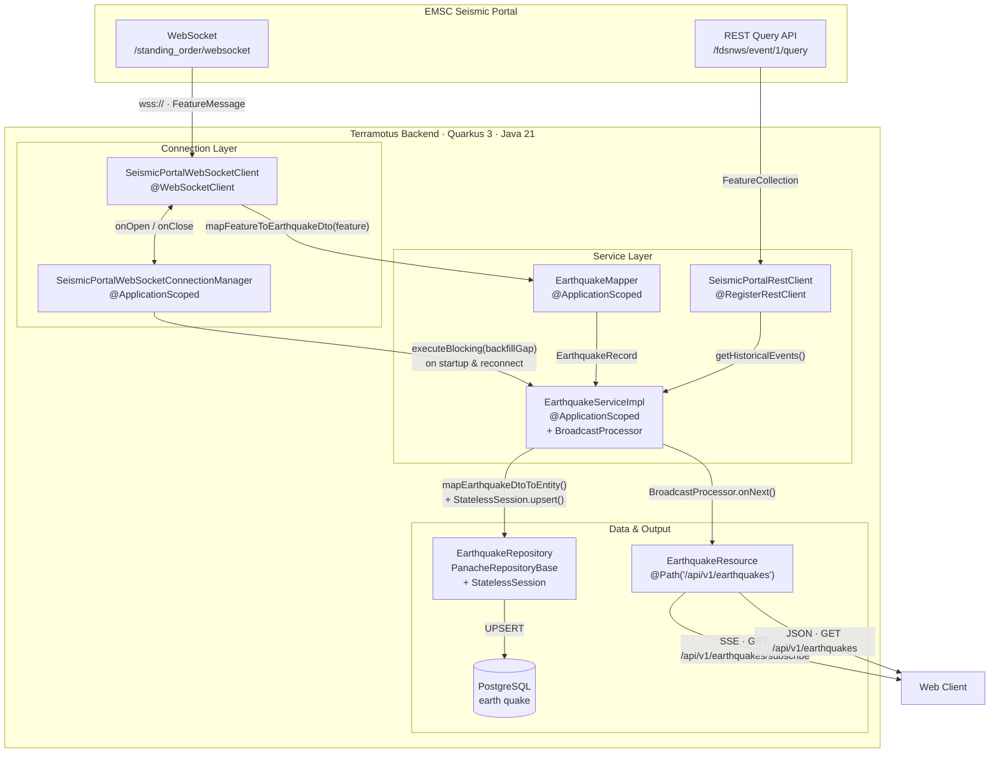
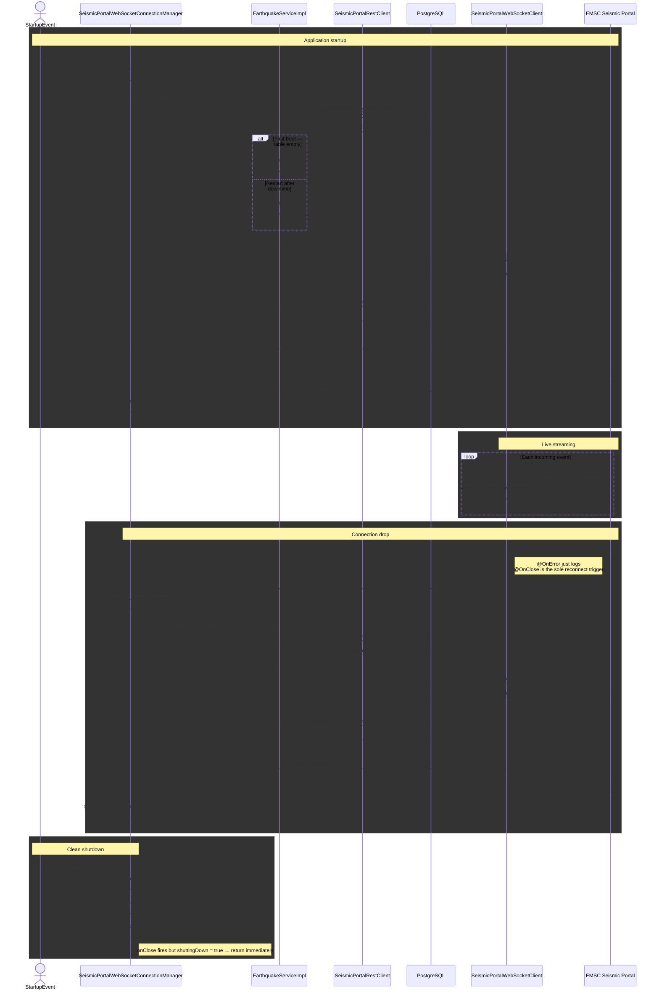
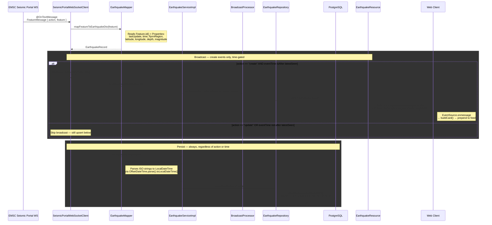

# Terramotus Speculator
A real‑time seismic monitoring system that ingests live earthquake data from the [EMSC Seismic Portal](https://www.seismicportal.eu) and broadcasts it to connected clients via Server‑Sent Events (SSE).

 ---
 
## Key Features
- **Live Event Streaming** - Maintains a persistent WebSocket connection to EMSC, broadcasting new seismic events to all connected clients in real time.
- **Automatic Data Recovery** - On startup or after any connection drop, the system backfills the gap between the last recorded event and the current time, ensuring zero data loss. The initial backfill covers the past 24 hours.
- **Resilient Ingestion Pipeline** - If the WebSocket connection fails, the backend:
  - Backfills missing data since the last persisted event.
  - Re‑establishes the WebSocket connection.
  - Resumes broadcasting and persisting new events.
- **Historical Query API** - All ingested events are stored in a database and exposed via a RESTful API, allowing clients to query historical seismic data.
- **Idempotent Persistence** - Events are upserted by their unique ID, preventing duplicates and ensuring data consistency across reconnections and backfills.

---

## Tech Stack

- **Java 21**
- **Maven 3+**
- **Quarkus v3.36.3**

### Quarkus Extensions

- `quarkus-arc` - Dependency injection
- `quarkus-rest` + `quarkus-rest-jackson` - REST API + SSE broadcast
- `quarkus-rest-client-jackson` - REST client for EMSC Query API
- `quarkus-hibernate-orm-panache` - ORM with `StatelessSession` for bulk operations
- `quarkus-jdbc-postgresql` - PostgreSQL driver
- `quarkus-websockets-next` - Outbound WebSocket client

### External Services

- **PostgreSQL** - Primary data store
- **[EMSC Seismic Portal](https://www.seismicportal.eu)** - Data source
  - [FDSN WS-EVENT API](https://www.seismicportal.eu/fdsn-wsevent.html) - Historical queries
  - [(Near) Realtime WebSocket](https://www.seismicportal.eu/realtime.html) - Live event stream
 
---

## System Architecture

---

## Startup & Reconnect Lifecycle

---

## Event Journey

---

## Screenshots

